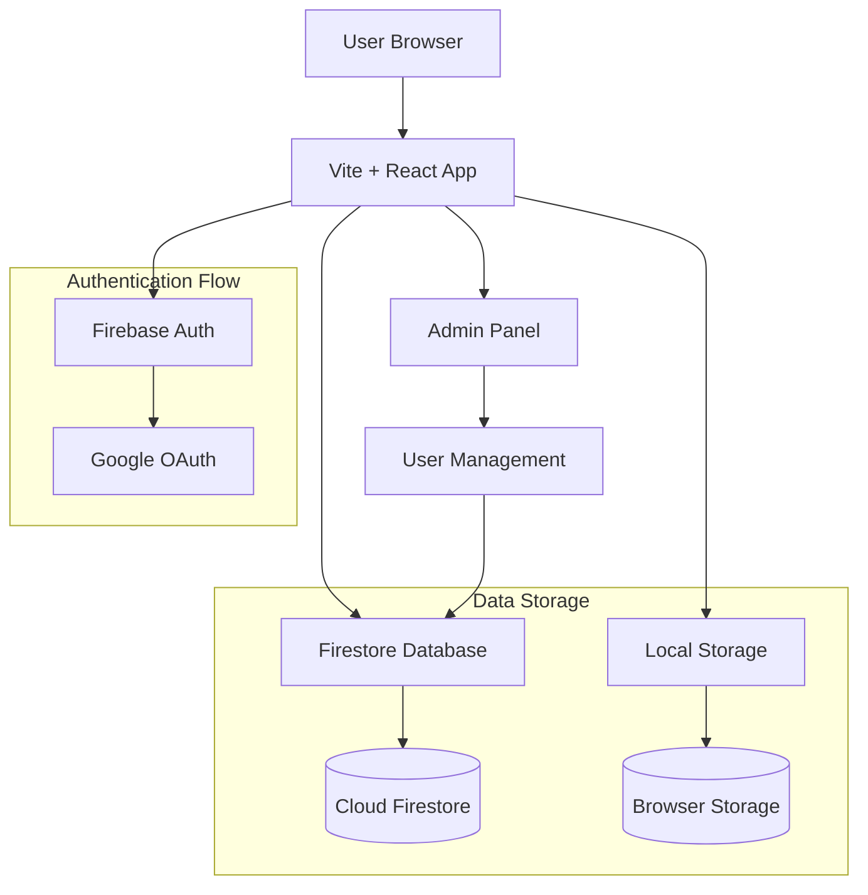
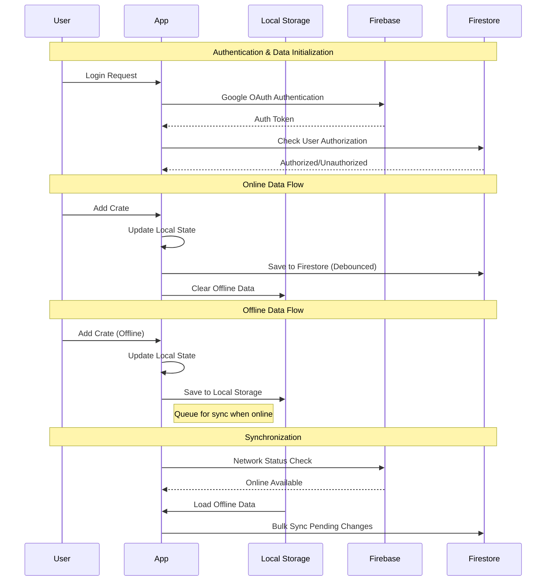
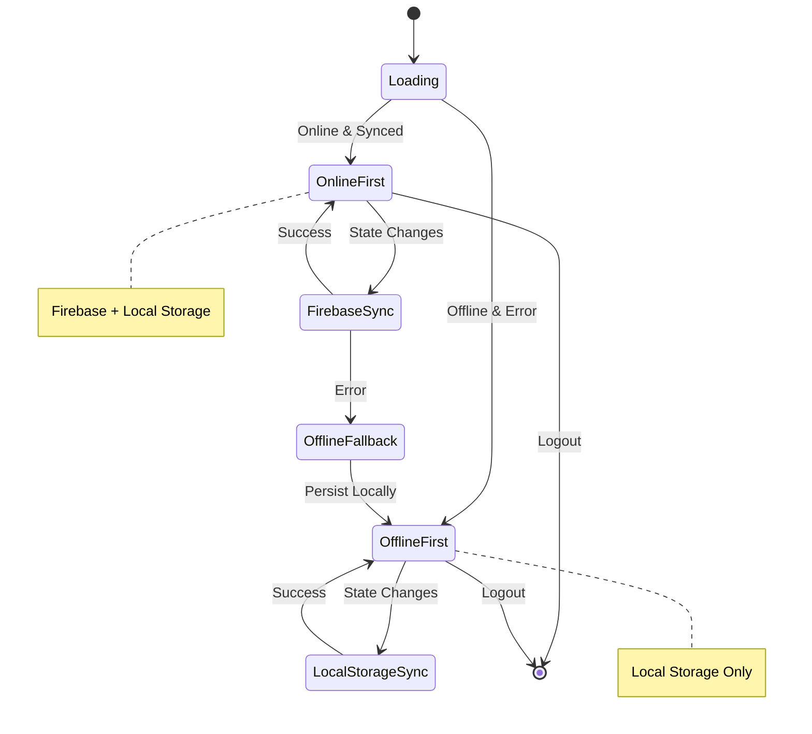
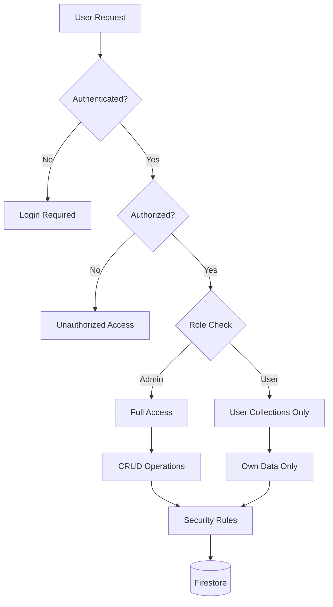

# Crate Tracker Architecture Documentation

## System Overview

Crate Tracker is a modern web application built with React and Firebase that provides real-time crate tracking functionality for F1 Clash players. The application features offline-first architecture with cloud synchronization, ensuring users can track their progress even without internet connectivity.

## High-Level Architecture



## Architecture Components

### Frontend Application Layer

#### React Application (Vite)
- **Framework**: React 18 with TypeScript
- **Build Tool**: Vite for fast development and optimized production builds
- **UI Framework**: TailwindCSS for responsive, mobile-first design
- **State Management**: Custom React hooks with local component state
- **Routing**: Component-based navigation (no external router)

#### Key Components
- `App.tsx`: Main application component with error boundaries
- `AuthContext.tsx`: Central authentication and data management context
- `Login.tsx`: Google OAuth authentication interface
- `AdminView.tsx`: Administrative user management interface
- `ConfigView.tsx`: User data backup/restore functionality

### Backend Services

#### Firebase Authentication
- **Provider**: Google OAuth integration
- **Authorization**: Gmail-based access control with admin-managed user list
- **Security**: Server-side security rules enforce access restrictions
- **Token Management**: Automatic token refresh and session handling

#### Cloud Firestore
- **Database**: NoSQL document database with real-time capabilities
- **Collections**:
  - `authorizedUsers`: Admin-managed user access list
  - `users`: User data storage (crates, configuration)
  - `test`: Development testing collection
- **Security**: Granular security rules with role-based access

### Data Flow Architecture



### State Management Strategy



#### Key Features
- **Offline-First Approach**: App works fully offline, syncs when possible
- **Intelligent Prioritization**: Uses available data sources based on network status
- **Debounced Saves**: Prevents excessive Firestore writes (500ms delay)
- **Conflict Resolution**: Firebase takes precedence when online, with ignore flags
- **Action Queuing**: Offline changes are queued for synchronized replay

### Security Architecture



#### Security Layers
1. **Authentication**: Firebase Auth with Google OAuth
2. **Authorization**: Gmail-based whitelist with admin management
3. **Access Control**: Firestore security rules enforce data isolation
4. **Encryption**: Data encrypted in transit and at rest
5. **Role-Based Access**: Admin vs. normal user permissions

### Data Model

#### User Document Structure
```typescript
interface UserData {
  allCrates: string[];  // Array of crate colors won
  config: {
    wins: number;       // Total game wins
    gpWins: number;     // Grand Prix wins (subset of wins)
  };
}
```

#### Authorized User Document
```typescript
interface AuthorizedUser {
  email: string;        // Gmail address (lowercased)
  role: 'admin' | 'normal';
  status: 'active' | 'inactive';
  createdAt: Timestamp;
  updatedAt: Timestamp;
  invitedBy?: string;   // Admin who created record
}
```

### Deployment Architecture

#### Firebase Hosting
- **Production**: Continuously deployed from main branch
- **Staging**: Test environment for validation
- **GitHub Actions**: Automated CI/CD pipeline

#### Docker Support
- **Containerization**: Standalone deployment option
- **Environment Variables**: Flexible configuration
- **Registry**: GitHub Container Registry support

### Performance Considerations

#### Frontend Optimizations
- **Code Splitting**: Vite enables intelligent bundle splitting
- **Lazy Loading**: Components loaded on demand
- **Debounced Operations**: Reduces API calls and improves UX
- **Responsive Design**: Mobile-first approach with TailwindCSS

#### Backend Optimizations
- **Real-time Updates**: Firestore listeners for live data sync
- **Offline Persistence**: IndexedDB for local data caching
- **Batch Operations**: Bulk writes for performance
- **Security Efficiency**: Rules evaluated server-side without code bloat

#### Monitoring & Reliability
- **Error Boundaries**: Component-level error isolation
- **Performance Monitoring**: Built-in performance tracking utilities
- **Network Detection**: Automatic offline/online mode switching
- **Retry Logic**: Failed operations automatically retry

## Technology Stack

### Core Technologies
- **Frontend**: React 18, TypeScript, Vite
- **UI**: TailwindCSS, Heroicons
- **Backend**: Firebase (Auth, Firestore)
- **Testing**: Vitest, React Testing Library
- **Linting**: ESLint with TypeScript integration
- **Build**: Vite with optimized production builds

### Development Tools
- **Package Manager**: npm
- **Testing**: Vitest with UI support
- **Code Quality**: Prettier for formatting
- **Type Checking**: TypeScript strict mode
- **CI/CD**: GitHub Actions with automated deployments

## Architectural Decisions

### Why Firebase?
- **Scalability**: Serverless architecture scales automatically
- **Real-time**: Built-in real-time synchronization
- **Security**: Comprehensive security rules and authentication
- **Offline**: Robust offline support with automatic sync
- **Ecosystem**: Integrated auth, hosting, and database

### Why React Hooks?
- **Simplicity**: No external state management library complexity
- **Performance**: Direct integration with React's rendering system
- **Testability**: Pure functions with clear dependencies
- **Maintainability**: Co-located logic with components

### Why Offline-First?
- **Reliability**: App works without internet connectivity
- **User Experience**: Instant feedback and responsiveness
- **Data Safety**: Local persistence prevents data loss
- **Sync Flexibility**: Users control when and how to sync data

## Future Considerations

### Scalability Plans
- **Database Sharding**: Potential Firestore collection partitioning
- **Caching Layer**: CDN integration for static assets
- **Microservices**: Potential backend function separation
- **Analytics**: Usage metrics and performance monitoring

### Feature Extensions
- **Mobile Apps**: React Native cross-platform support
- **Advanced Analytics**: Detailed crate pattern analysis
- **Social Features**: Leaderboards and community sharing
- **API Integrations**: Third-party game integrations

This architecture provides a solid foundation for current needs while maintaining flexibility for future growth and feature additions.
